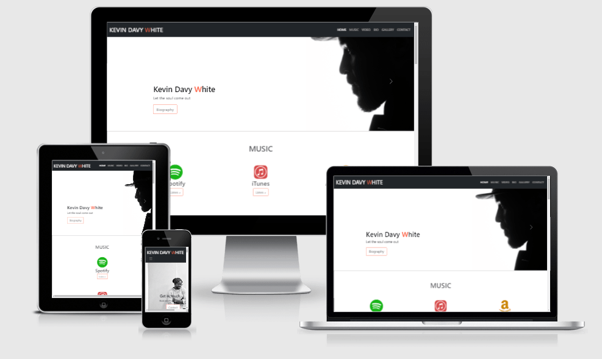

# Kevin Davy White

## Code Institute Project Portfolio 01
The first project was to develop a static front end webpage using HTML and CSS 
following the UX industry conventions with a minimum og three separate page areas.
This page was created for educational purposes.

[View website in GitHub Pages.](https://kevindgnanih.github.io/M1-repository-v1/)

Screenshot from [Am I Responsive](http://http://ami.responsivedesign.is/#)

## [Kevin Davy White Page](https://kevindgnanih.github.io/M1-repository-v1/)

The website is created to showcase the singer-songwriter Kevin Davy White. Providing music streaming platform links, videos and information about the artist
through out the webpage.

###### The sections of the webpage are:

1. Home/Banners carousel style
2. Music section/ Favourite streaming music platform
3. Video section/ Embedded YouTube videos
4. Biography section/Biography along side of pictures
5. Gallery section
6. Contact section/Form

The website layout is structered in a way to guide the use to discover the artist via different medias and highlights
his talent and professionalism. These sections and information lead the use to the contact form.

** The business goals of this website are: **
_ To inform users about the talented artist.
_ To increase booking and streams
_ To encourage potential fans or clients to contact  or book the artist.

###### The customer goals of this website are:

_ To find out more information about the artist and his musics.
_ To be entertained with musics and videos.
_ To find effortlessly contact information to touch base or book the artist.
_ To view promotional activity such as social media.
This is a base Bootstrap template using the carousel component.

# UX

### Strategy

My strategy for the site was to provide content and ease of access to users and fans trying to attain information by utilising the key UX principals.
I believe that giving credible, valuable and usable infos were higly significant to implement in the project. By proving the best features/technologies the customeners and fans want.

###### Ideal users of the website:

_ Fan of Blues-Rock musics
_ Festival promoter
_ Venue managers

###### These users are looking for:

_ An music expercience, a professional artist
_ Evidence of promotional work

The website was made in a way to not overwelme the users with clean and ituative information and navigation.
Most of the users discover artist from their mobile phones, so therefore creating something responvise was essential.

### Scope

In order to achieve the discovery and strategy goals, the following features wwere included in this release:

- Header and menu bar, to navigate to various sections of the page
- Banner section in carousel style to showcase some straight forward actions
- Three favourite music streaming platforms ready to be clicked and listen
- Three video of the artist's performance to showcase his live talent and charisma
- A short biography with pictures along side to make the reading easy and contectual
- A stylish gallery to showcases some perfomances and artist style
- Simple Contact form
- Footer containing links to social media

### Structure

This is a single-page website to allow the easiest navigation possible. With the conventional navigation bar at the top allows effortless move in the page 
to whatever section the user wants to go to with a scrollspy to information easly where they are in the page. I've chosen the following order for the information
"Home/Carousel -> Music -> Video -> Biography -> Gallery -> Contact" because I felt this would allow the information to be disgested in the best way. While allowing the user to learn more about the artist, music and experience they could have, and finishing with the contact form to call them for an action.

### Skelton

Picture of my scketching here

Please note the actual website has sligthly change from the initial wireframes.

While building the website I felt that the sections order were the best way to go for by going to the point with music section as first. Then only scrolling doing to get a bit more information and divertisement at the same time. I wanted three collumns of information because I felt it was the write balance of throught the sections and amount without overloading the sections and the user.

I aslo regroup all three pages into one to no disturbing the flow of information and navigation of the user. Because I thought hte main audiance will be using mobile. It is always better to not disturb the user going through several pages for the same topic.

I also was creative while building the design of the website and decided along the building process. As a musician, it is an asets very useful to incorport feel, style and putting myself in the user shoes.

### Surface

I chose the theme color of the artist Kevin Davy White red, white-off and black. Those colors keep the brand and appear less cluttered and minimalistic adding to the overall UX. 

# Features

The webpage is fully responsive. Designed to work well on mobile up to desktop size. 
The page is divided into 6 sections listed in the navbar. I used the Bootstrap plugin, Scrollspy to intuitivilly update links in the navigation list based on the current scroll position, by highlithing the color of the current section with the accent color to reminf the user of their location on the site.
I also wanted to code the navbar to collapse into a Hamburger menu botton as it is ubiquitous and users understand it's purppose on mobile sites. 

### Header: 
The header features a responsive navigation bar with links pointing to each section on the right-hand sie with the artist logo placed on the left to follow standard industry practice. The navbar is fixed to allow the use ease of access to the site's core functionalities and as a resultm generates high usability for the one*page website.
Containing a Bootstrap carousel of 3 immersive imgaes of the artist. This signifies the charisma and calming persona of the artist. 
Each image points to three informative sections of the website, Biography, Musics and Contact. Each of these images includes a caption reflecting that particalr section.
The header was intentionally designed with monochrome theme to strategically draw the user's attention to the logo and theme color of the artist.

### Music Section:

This section starts with an H1 heading centered followed by three favourites music platforms links. in those three music streaming services, I'm using Font Awesome icons.
This structure is used to provided clarity of the items wihthin the section and make it easy to understand at a glance.
The stucture allows the users to direct their attention to their favourite music streaming platforms they are more intrested in. 

### Video Section:

In this sections I used a similar approch to the music section above to keep a fluid experiance to the user and keep the same shape of the page.
Starting with a H1 followed by three videos below. Those video are embended from YouTube source.

### Biography Section:

This biography section is where users can have a brief insight into who is Kevin Davy White, and discover a summury of his journey until now.
I wanted to keep this section small, clean with some picture that goes along side of the paragraphs.

### Gallery Section:

The Gallery section starts with a H1 header followed by three collums of two rows "Desktop size".
When the user click on any images a Bootstrap layout pop up on top of the webpage with semi transparent black background to highlight and separate the 
image from the background.

### Contact Form:

After the users has gained knowledge and is confidence from the content, they finally land to simple Contact form. The form is compiled of onlu the necessary informatiuon required to avoid the user losing intrerst and not making contact. Most of the inputs are required to submit the form. The colour oallet used is the same across the site. 

### Footer:

The footer section contains copyrights information as well as external links to the artist's social media channels and a "Back to top" button for the users to easily reach to top without any effort to improve the overall UX.

# Technologies Used

