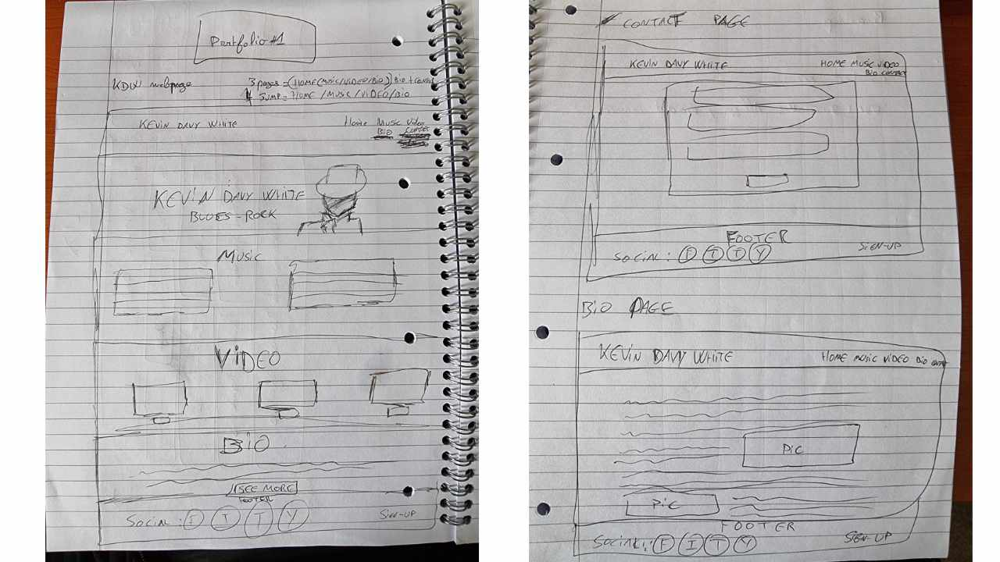
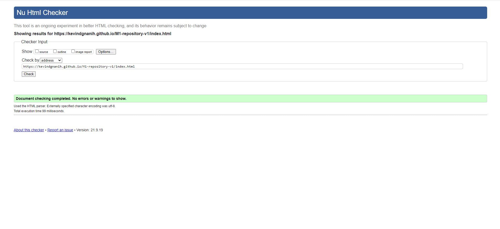
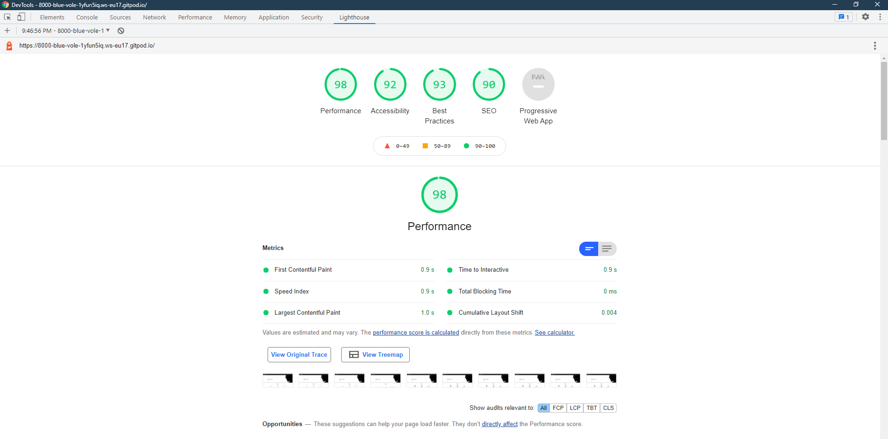
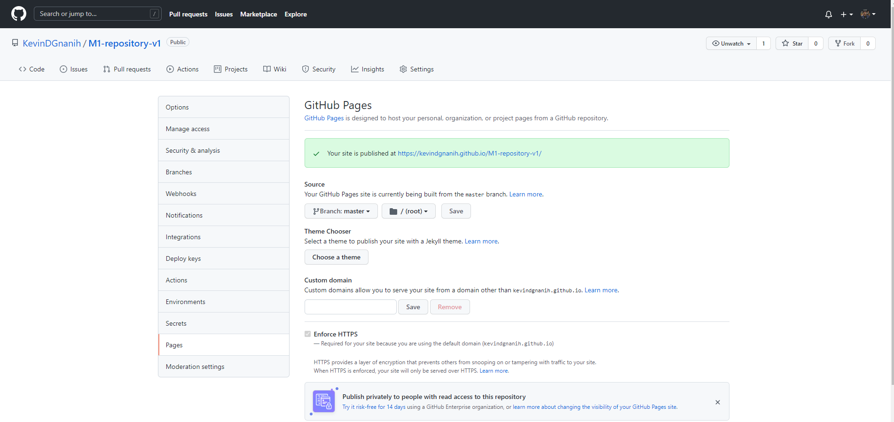

# Kevin Davy White

## Code Institute Project Portfolio 01
The first project was to develop a static front-end webpage using HTML and CSS 
following the UX industry conventions with a minimum of three separate page areas.
This page was created for educational purposes.

[View website in GitHub Pages.](https://kevindgnanih.github.io/M1-repository-v1/){:target="_blank"}

Screenshot from [Am I Responsive](http://http://ami.responsivedesign.is/#)

## [Kevin Davy White Page](https://kevindgnanih.github.io/M1-repository-v1/)

The website is created to showcase the singer-songwriter, Kevin Davy White. Providing music streaming platform links, videos, and information about the artist
throughout the webpage.

**The sections of the webpage are:**

1. Home/Banners carousel style
2. Music section/ Favourite streaming music platform
3. Video section/ Embedded YouTube videos
4. Biography section/Biography alongside pictures
5. Gallery section
6. Contact section/Form

The website layout is structured in a way to guide the user to discover the artist via different media and highlights
his talent and professionalism. These sections and information lead the user to the contact form.

**The business goals of this website are:**
- To inform users about the talented artist.
- To increase booking and streams
- To encourage potential fans or clients to contact or book the artist.

**The customer goals of this website are:**

- To find out more information about the artist and his music.
- To be entertained with musics and videos.
- To find effortlessly contact information to touch base or book the artist.
- To view promotional activity such as social media.
This is a base Bootstrap template using the carousel component.

# UX

### Strategy

My strategy for the site was to provide content and ease of access to users and fans trying to attain information by utilizing the key UX principles.
I believe that giving credible, valuable, and usable infos were highly significant to implement in the project. By proving the best features/technologies the customers and fans want.

**Ideal users of the website:**

- Fan of Blues-Rock music
- Festival promoter
- Venue managers

**These users are looking for:**

- An music experience, a professional artist
- Evidence of promotional work

The website was made in a way to not overwelm the users with clean and ituitive information and navigation.
Most of the users discover artists from their mobile phones, so therefore creating something responsive was essential.

### Scope

In order to achieve the discovery and strategy goals, the following features were included in this release:

- Header and menu bar, to navigate to various sections of the page
- Banner section in carousel style to showcase some straightforward actions
- Three favorite music streaming platforms are ready to be clicked and listen
- Three videos of the artist's performance to showcase his live talent and charisma
- A short biography with pictures alongside to make the reading easy and contextual
- A stylish gallery to showcases some performances and artist style
- Simple Contact form
- Footer containing links to social media

### Structure

This is a single-page website to allow the easiest navigation possible. The conventional navigation bar at the top allows effortless move in the page to whatever section the user wants to go to with a Scrollspy to the information easily where they are on the page. I've chosen the following order for the information
"Home/Carousel -> Music -> Video -> Biography -> Gallery -> Contact" because I felt this would allow the information to be disgested in the best way. While allowing the user to learn more about the artist, music, and experience they could have, and finishing with the contact form to call them for action.

### Skelton

Please note the actual website has slightly changed from the initial wireframes.

While building the website I felt that the section's order was the best way to go for by going to the point with the music section as first. Then only scrolling doing to get a bit more information and divertisement at the same time. I wanted three columns of information because I felt it was the right balance through the sections and amount without overloading the sections and the user.

I also regroup all three pages into one to not disturbing the flow of information and navigation of the user. Because I thought the main audience will be using mobile. It is always better to not disturb the user going through several pages for the same topic.

I also was creative while building the design of the website and decided along the building process. As a musician, it is an asset very useful to incorporate feel, style, and putting myself in the user's shoes.

### Surface

I chose the theme color of the artist Kevin Davy White red, white-off, and black. Those colors keep the brand and appear less cluttered and minimalistic adding to the overall UX. 

# Features

The webpage is fully responsive. Designed to work well on mobile up to desktop size. 
The page is divided into 6 sections listed in the navbar. I used the Bootstrap plugin, Scrollspy to intuitively update links in the navigation list based on the current scroll position, by highlighting the color of the current section with the accent color to remind the user of their location on the site.
I also wanted to code the navbar to collapse into a Hamburger menu button as it is ubiquitous and users understand its purpose on mobile sites. 

### Header: 
The header features a responsive navigation bar with links pointing to each section on the right-hand side with the artist logo placed on the left to follow standard industry practice. The navbar is fixed to allow the user ease of access to the site's core functionalities and as a result, generates high usability for the one*page website.
Containing a Bootstrap carousel of 3 immersive images of the artist. This signifies the charisma and calming persona of the artist. 
Each image points to three informative sections of the website, Biography, Musics and Contact. Each of these images includes a caption reflecting that particular section.
The header was intentionally designed with a monochrome theme to strategically draw the user's attention to the logo and theme color of the artist.

### Music Section:

This section starts with an H1 heading centered followed by three favorites music platforms links. In those three music streaming services, I'm using Font Awesome icons.
This structure is used to provided clarity of the items within the section and make it easy to understand at a glance.
The structure allows the users to direct their attention to their favorite music streaming platforms they are more interested in. 

### Video Section:

In this section, I used a similar approach to the music section above to keep a fluid experience for the user and keep the same shape of the page.
Starting with an H1 followed by three videos below. Those videos are embedded from YouTube sources.

### Biography Section:

This biography section is where users can have a brief insight into who is Kevin Davy White, and discover a summary of his journey until now.
I wanted to keep this section small, clean with some picture that goes alongside the paragraphs.

### Gallery Section:

The Gallery section starts with an H1 header followed by three columns of two rows "Desktop size".
When the user clicks on any images a Bootstrap layout pop up on top of the webpage with a semi-transparent black background to highlight and separate the image from the background.

### Contact Form:

After the users have gained knowledge and are confident from the content, they finally land to a simple Contact form. The form is compiled of only the necessary information required to avoid the user losing interest and not making contact. Most of the inputs are required to submit the form. The color pallet used is the same across the site. 

### Footer:

The footer section contains copyrights information as well as external links to the artist's social media channels and a "Back to top" button for the users to easily reach to top without any effort to improve the overall UX.

# Technologies Used

In the construction of this website, I have used several technologies to program the page.

- [HTML5](https://developer.mozilla.org/en-US/docs/Web/HTML)
    - Used as the basic building block for the project and to structure the content
- [CSS3](https://developer.mozilla.org/en-US/docs/Learn/Getting_started_with_the_web/CSS_basics)
    - Used to style all the web content across the project.
- [JavaScript](https://www.javascript.com/)
    - Used for the responsive navbar, form, scroll down arrow and read more/read less button.
- [Bootstrap v5.1.1](https://getbootstrap.com/)
    -The project used Bootstrap to provide overall responsive behavior on all devices and simplify the website layout.
- [GitPod](https://www.gitpod.io/)
    - I used Gitpod as the development environment for the website.
- [GitHub](https://github.com/)
    - The project used Github to host my code that was created and pushed from GitPod.
- [Affinity Photo](https://affinity.serif.com/en-gb/photo/)
    - I created pictures to fit the mood of the artist and arranged the resolution to assure good quality images.
- [Font Awesome](https://fontawesome.com/)
    - I used the font & icon toolkit Font Awesome in the music section and footer links and back to top button to define elements by a visual means.
- [YouTube](https://www.youtube.com/)
    - For all my video section links, I used the video-embedded platform YouTube to give the chance of the users to be entertained while staying on the page.
- [Google Fonts](https://fonts.google.com/)
    - Google fonts were used to style the website fonts.
- [W3C CSS Validation Service](https://jigsaw.w3.org/css-validator/)
    - W3C CSS Validation Service was used to check the validity of my CSS in the project.
- [W3C Markup Validation Service](https://validator.w3.org/)
    -The W3C Markup Validation Service checked the markup validity of Web documents in HTML.
- [Optimizilla Image Compressor](https://imagecompressor.com/)
    - Optimizilla was used to further compress the images with custom compression options.

# Testing 

## UX stories
        
**As a new visitor or fan, I want to easily navigate the site to find whether the designer the right fit for my needs.**
        
The user can navigate through the website using the navbar menu on the top right-hand side of the page.
The logo links the user back to the Home Page.

**As a new visitor or fan, I would like to find Music and Video of the artist to see if I like the music and the image of the artist.**
        
There is a clear direction in the navbar that to find out more info on the artists represented, the link for "Music" & "Video" should be selected. Also in the carousel in the header, there is a caption "In your favorite music streaming platforms" and a Call To Action button to "Listen NOW". Links direct to the correct section.

**As a new visitor or fan, I want to have more information and experience about the artist.**
        
There is an option in the navigation bar called "Biography" to learn more about the artist. Also in the slider, there is a caption reading "Let the soul come out" with a all to action displaying to "Biography". Links direct to the relevant section.

**As a new visitor or fan, I want to see more images and promotion pictures of the artist.**
There is an option in the navigation bar called "Gallery" to see more promotion pictures of the artist.

**As an interested new visitor or fan, I want to contact them about working together.**

There is a prominent button at the top of the page directing the user towards the contact form. The form does not allow the user to submit their inquiry until all fields are completed otherwise they will receive a prompt. This was achieved using the required attribute.

**As a new visitor or fan, I want to check out their social media channels**

There are social media icons found in the footer which link to the company's channels.
Also, copyright information on the left side of the footer and a button "Back to top" on the right side of the page to let the users going back up to the page without scrolling 

# Code Validation

## HTML and CSS Validation

I used the [W3C Markup Validation Service](https://validator.w3.org/) to check the Markup and [W3C CSS Validation Service](https://jigsaw.w3.org/css-validator/) to check the CSS
validity of the site.

After fixing the errors on both testing sites, the site eventually passed the W3C Validation.

## Lighthouse

Lighthouse is a feature of Google Chrome developer tools and is used to assess the performance of the website and its features. I achieved a low-performance score initially.
But I made a conscious effort to increase this by reducing the image quality, added some aria-label, and fixing some conventional issues in my HTML and CSS files. Furthermore, 
I added the "rel=noreferrer" to some of my external links as this is considered best practice.

I am very pleased to now hitting above 90 for all scores:

# Deployement

I deployed this website by using GitPages and following the below steps:

GitHub pages deployment

1. Log in to GitHub
2. In your Repository section, selected the project repository that I wanted to deploy
3. In the menu located at the top of this section, clicked "settings"
4. Selected "Pages" on the left-hand menu; This is around the end of the menu.
5. In the source section, select branch "Master" and saved.
6. The page is then given a site URL which you will see above the source section, it will look like the following below:

# Credits

I've used a number of resources to produce this website:

- The embedded videos used in this site were obtained from [YouTube](https://www.youtube.com)
- All the pictures used in this site were obtained from the artist [Kevin Davy White](https://www.kevindavywhite.com)

## Acknowledgements

I would like to thanks my mentor [Guido Cecilio](https://github.com/guidocecilio) for his support and guidance throughout the course of this project.

